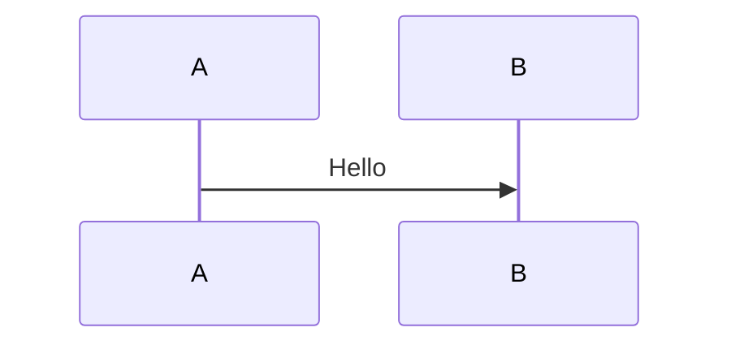

Chat GPT assistants to process and do name entity recognition on clinical note.
- User
- Medical professor
	- Review annotated clinical note
- Medical terminologist
- Translator
- Annotators
- PII Auditor
	- Personally identifiable information (PII)

