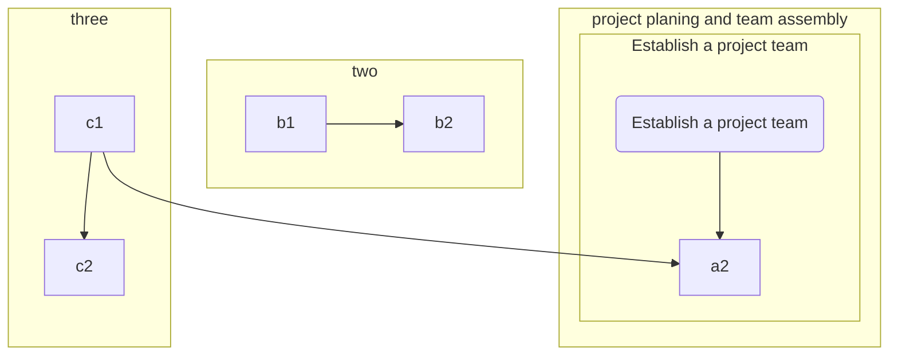

```mermaid
flowchart TB;
	c1-->a2
	subgraph "project planing and team assembly"
		subgraph "Establish a project team"  
			a1(Establish a project team)-->a2
		end
	end
	subgraph two 
		b1-->b2 
	end
	 
	subgraph three 
		c1-->c2 
	end
```
