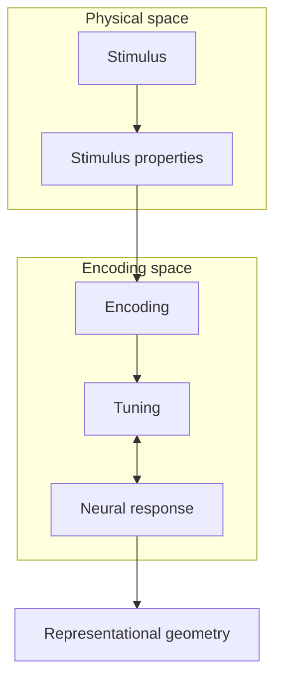
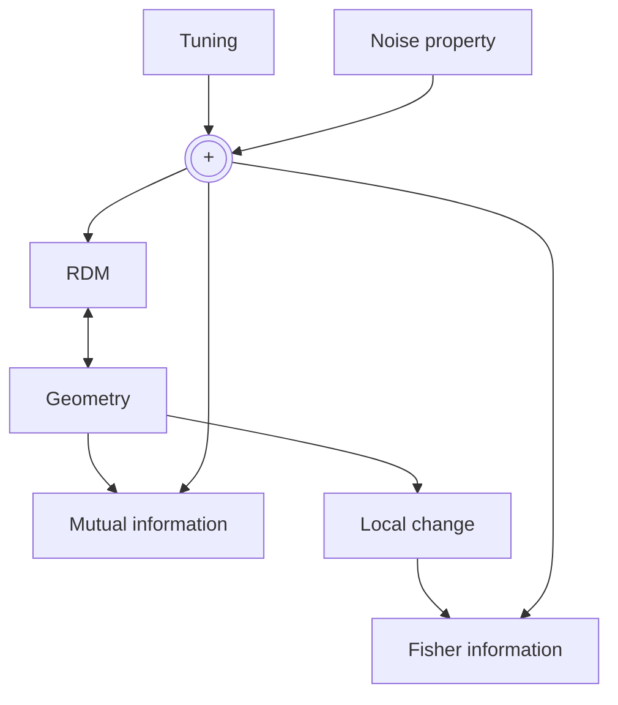
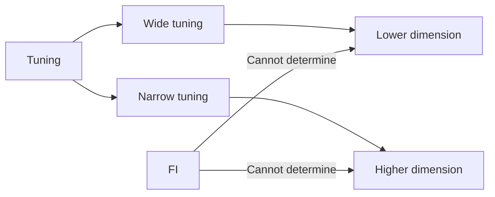
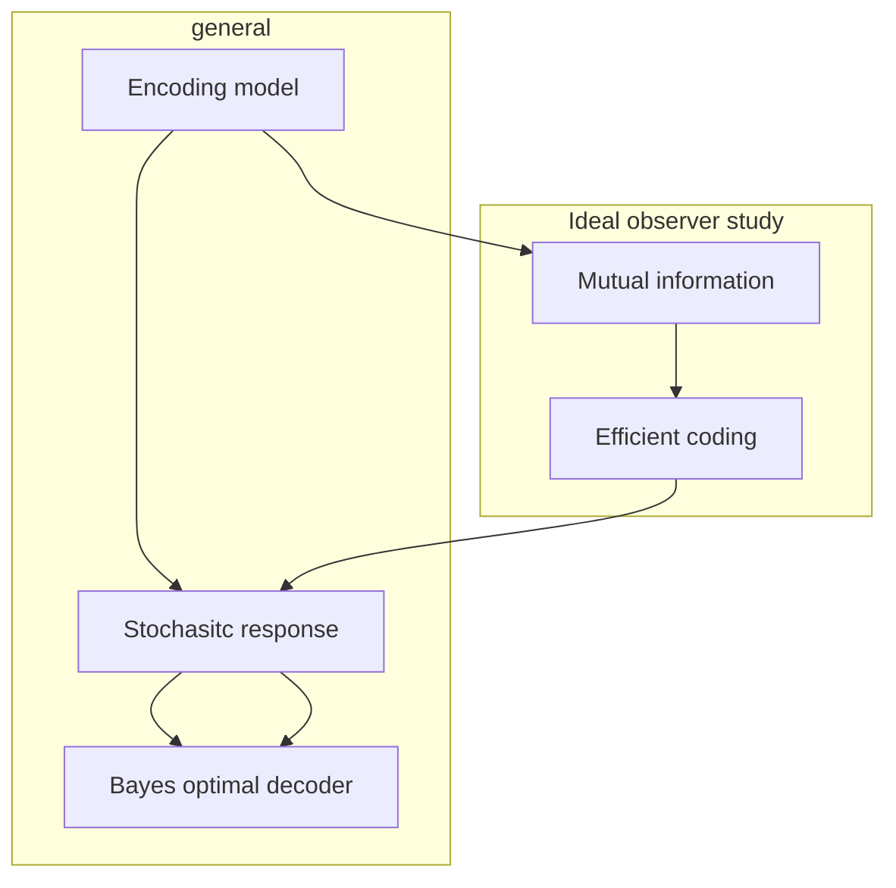
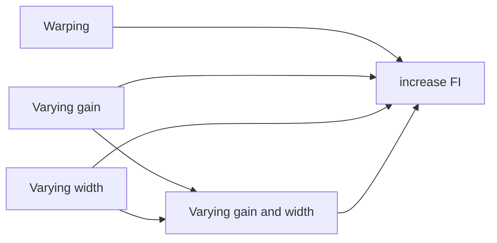

---
authors:
  - Xue-Xin Wei
  - Nikolaus Kriegeskorte
article type: review
---
# Central goal of neuroscience
- Understanding the [representations](representation) form by brain activity patterns and their connection behavior. Many methods, paradigms are created to solve this problem of [[representation ]].
	- [Tuning analysis](neural%20tuning.md)
		- Usually [[Fisher information]] (FI) in characterization of sensitivity in [neural responses](neural%20response) to small change of stimulus
	- Population analysis
		- focus on information obtainable from [linear decoder](linear%20decoder.md) → usually captured by geometry of the representational patterns in multivariate responses space
		- Tuning induced geometry
		- Different sets of tuned neurons can induce the same geometry
		- This geometry determines the [[Fisher information]], [[mutual information]] and the behavioral performance

# Main Ideas
- To persuade that future studies can benefit from considering both tuning and geometry to understand neural codes

# Introduction

- Brain computation can be seen as the transformation of representations across stages of processing
	- This process enabling inferences and decisions for successful actions
	- Neuroscientists often focus on one particular [[neural population]] at a time 
	- The process of producing code in $X$ as [[encoder]] and the process of exploiting the code in $X$ as [[decoder]]
- [Neural code](neural%20code) is classically characterized by [[neural tuning]] which generally describe dependencies of neural activities on a particular sets of variables/stimulus. The analogy comes from the [radio tuning](Radio-tuning%20(Analogy)) that we voluntarily select to a specific wavelength to listen to.
	- The classic example to this view comes from [[Hubel and Wiesel]] works on firing rate of many neurons in [[primary visual cortex ]][(V1)](V1) is *modulated systematically* by position and orientation of and edge visually presented to a cat.
	- [Tuning curve](tuning%20curve) is one of quantitative descriptions of a neuron's response as a function of *a particular stimulus property*.
	- Set of tuning curves can be used to define [[population code]]
- We have accumulated knowledge about how [[neural tuning]] changes with spatial context, temporal context, internal states of animal such as [[attention]] and [[learning]]
	- It is ideal for characterizing strong dependencies of individual neurons' responses on environmental variables.
	- However, it can detract from non-stimulus-related influences on neuronal activity
	- Despite the limitations, it can serve as useful **first-order description** of how individual neurons encode behaviorally relevant information
- Complementary perspective to [[neural tuning]] is **decoding**. Downstream neurons which receives input from a [[neural population]] and must read out particular information that contributes to behavior.
> [!Question]
> What information can be read out from a population of neurons
- Decoder analysis gain momentum as ability to record from a large number of channels (such as [[functional imaging]])
	- Mostly with [[linear decoder]] which give the question → is linear decoder good enough?
	- More general approach is to characterize the [[representational geometry]]
		- This method captures all possible projections of the population response pattern and characterizes all the information available to [[linear]] and [[non-linear decoder]]s. 
		- This is well-defined by pairwise distances in the [[representational space]] among response patterns corresponding to a set of stimuli
		- Distances can be compressed in form of [[representational dissimilarity matrix (RDM)]] 
			- The [[dissimilarity]] here is a more general term including [estimators](estimator) that are not distances in mathematical sense
			- This method of representation is constrained by pairwise distances which is rotational invariance in representational space → indicating that there are many ways to acquire the same RDM
- The [[neural tuning]] determines [[representational geometry]] as well, so these two methods should be related. Even if they are separately originated.
- Recent years show cross pollination between above methods

# A dual perspective, Tuning determines the MI and FI
How informative the neural response is depends on the shape of the tuning curves.
- Flat tuning curve ↔ no tuning 
The decoding issue in a single neuron with tuning curve is not well-defined since there can be multiple stimulus properties that produce the same activity. For example, neurons can respond to 70 deg and 110 deg the same ways with neuron tuned to 90 deg. This can, however, be addressed by multiple neurons decoding.

For a population of neurons, the tuning function $f(\theta)$ can be defined as expectation value of response pattern $\mathbf{r}$ given stimulus parameter $\theta$
$$
\begin{equation}
f(\theta) = \mathbb{E}_{\mathbf{r}\sim p(\mathbf{r}|\theta)}[\mathbf{r}] = \mathbb{E}[\mathbf{r}|\theta]
\end{equation}
$$
In a special case that of [[additive noise]] with zero mean $\epsilon$. response pattern obtained as $\mathbf{r} = f(\theta) + \epsilon$ defines tuning function.

## Mutual information (MI)
- Is function of **[[joint probability distribution]]** that generally tells us how informative of a variable $X$ to infer the actual value of $Y$ . This generally relate to [[entropy]] since the entropy quantifies average [[self information]].
	- In terms of [[conditional probability]] (or [[likelihood]]), this require additional estimated value of [[prior]]
	- The optimization of MI in code reflect the [[statistical structure]] of the environment
	- With constraint of limited neurons, this can be used to derive efficient coding
	- Can be thought as the expected value across stimuli parameter of the reduction of the uncertainty about stimulus orientation
	- Do not capture how fidelity depends on stimulus
		- Some authors propose MI variants to solve this

# Fisher information
- Root in [[statistical estimation theory]]
- Capture **[[precision]]** of which stimulus is encoded 
- Efficient coding will dedicate resources to frequent stimuli and encode it with greater precision
- Many works found relation between tuning parameters, for example: tuning width and firing rate, and FI
- Harder to compute
- It also capture the noise distribution in neural responses by definitions
- In case of independent noise, **population FI can be computed as sum of individual FI**
- In case that noise is correlated between neurons, it is still an **active area of research**

## Tuning determines geometry

- The pattern of neural response pattern move along $d$-dimensional [[manifold ]]as we vary $d$ stimulus properties
- Fisher information tells the magnitude of [[local change]] **within stimulus properties space**
- Representational geometry needed to be defined at **global scope** (such as relative distance/dissimilarity) including change of stimulus itself
	- (IMO) This view actually coincide with the [[variational calculus]] perspective where we explore the change in [[functional]] space (or [[functional derivative]])
- Dissimilarity measure can be defined in various ways
	- Accuracy of Bayes' optimal encoder
	- Accuracy or $d'$ of [[linear decoder]]
	- Mutual information between stimulus and neural response
	- Euclidean distances is [[monotonic]] related to these measures
		- With [[anisotropic noise]] → [[Mahalanobis distance]] is better
		- With [Poisson](poisson%20distribution) noise (independent between neurons) → [Square root transform](square%20root%20transform) can be used to mold the variation into Gaussian
- Tuning width do determines geometry
	- narrow tuning results in sparse representation and high dimensional manifold of neural response
		- This comes from non-redundancy of responses, each neuron serves as **selective all-or-none** ***independent*** axis
	- wide tuning results in approximately circular like representation manifold
		- Two non-identical wide tuning curves covering all possible stimulus space is enough to make a prediction for actual value so
	- If we implement [gain](gain%20%28neural%20tuning%29) or non-uniform across orientations, the geometry is distorted with a high FI locale spreading out but tightened low FI locale
> [!Question]
> This generally comes from the ability to accurately pinpoint the small difference from scaling. The locale with narrow range of neural response values mean lower FI as well as the larger error percentage for the same amount of deviation ?

## Geometry does not determine tuning
- First evidence from representational distance matrix (RDM) that determine geometry is invariant to rotation in representation space
- Geometry is not enough to tell us about how information is distributed across neurons

## Geometry determines the FI and MI

### Fisher information
[[Fisher information]] is, by definition, 
$$
\begin{split}
\mathcal{I}(\mathbf{r};\theta) := & \  \mathbb{E}_{\mathbf{r' \in \mathcal{D}(\mathbf{r})}}\Big[ \Big( \frac{\partial}{\partial \theta} \log p(\mathbf{r};\theta)\Big)^2 \  \Big\lvert \ \theta\ \Big] \\
= & \ \int_{\mathcal{D}(\mathbf{r})}{\Big( \frac{\partial}{\partial \theta} \log p(\mathbf{r};\theta)\Big)^2} p(\mathbf{r};\theta) \ d^{\dim{\mathbf{r}}}{\mathbf{r}}
\end{split}
$$
Fisher information is defined locally (for uniform gaussian noise) as 
$$
J(\theta) = \sum_{i=1}^{n}{[f_i'(\theta)]^2} = \Bigg\lVert \frac{\partial \mathbf{f}(\theta) }{\partial \theta} \Bigg\rVert_2^2
$$
for $\theta$ as stimulus parameter and $f_i$ neuronal response from $i^{th}$ neuron.
Overall FI can be calculated via integration along stimulus variables. This generally means **distance transverse as we change a stimulus property in [[neural manifold]]**. And the total Fisher information is then,
$$
J_{\text{tot}} = \int \sqrt{J(\theta)} \ \text{d}\theta
$$
> [!Question]
> What happens when noise is not assumed i.i.d. gaussian variable

### Mutual information
[Mutual information](mutual%20information) MI is defined as the different in [[entropy]] of target variable and explanatory variables.
In this case of neural responses, the [[entropy]] can be written as 
$$
I(\mathbf{r};\theta) = H(\mathbf{r}) - H(\mathbf{r}|\theta)
$$
- Geometry preserved transformation are rotation, translation and reflection
	- These transformations do not change densities of the joint distribution while re-parametizing $\mathbf{r}$

In case of additive isotropic gaussian noise,
$$H(\mathbf{r}|\theta) = H(\varepsilon)$$

## FI does not determine geometry
- It constraints only on local scope → Partially constraints geometry
- For each stimulus, FI only reflects the magnitude of local within-manifold gradient
- Doubling tuning curve's in 1 width reduce FI (for 1 stimulus property) by 2
	- multiply by 2 for twice number of neurons will be affected by changes in stimulus property
	- divide by 4 from slope reduction by 2 (therefore 4 for squared number in FI definition)
- The multiplication term from neuron inclusion by tuning width is proportion to dimension $$N \sim W^d$$
	- Two dimensional stimulus space gives invariant FI under change of tuning width

## Tuning determines sensitivity
- Predicting [[sensitivity]] requires decoding mechanism
- Fruitful/ widely used approach is assume an ideal observer

### General discrimination and perceptual estimation
- [[Bayesian ideal-observer model]] is used widely to explain how perceptual estimates might be computed

It is difficult to use MI as encoding constraint since MI is defined in global so it is too broad to generate some. Meanwhile FI is just length of neural manifold. In case of higher dimension, constraint FI along with RDM can be seen as orientating a constant-length string in $d$-dimensional space with some point needed to be close to some points proportion to distance in RDM.

### Open problem
Tuning functions that would emerge from [[maximization]] of the MI

### Fine discrimination
[Fine discrimination](fine%20discrimination) tasks are used to establish thresholds and characterize how stimulus are confused. However, do not reveal how frequent stimulus are confused.
Such performance in [[fine discrimination]] task is captured by[[ Fisher Information]]. If we know the noise distribution, then we need only tuning to determine FI.
Theoretically, the FI provides a lower bound on the discrimination threshold for [[fine discrimination]].
> [!Question]
> Is this the idea from ideal observer?

- The [[efficient coding]] will utilize the entire length of neural manifold
- Optimal mapping will 
	- Depends on the frequency to stimuli in natural experience
	- Have square root of the FI proportional to stimulus prior
- Uniform distribution of the stimuli on the **response manifold**
	- discrimination threshold $\delta$
$$\delta(\theta) \propto \frac{1}{p(\theta)} $$
## Geometry determines sensitivity
- We can estimate ideal observer [[perceptual sensitivity]] without tuning curves, but with representation geometry

### Binary discrimination
The performance is determined by [[representational distance]]between two stimuli. The closer representational distance means more confusion.
> [!Important]
> The representational distance reflect the decision of ideal observer (May be all the theoretical approaches are like that)

### Perceptual estimation
In the task of estimating parameter $\theta$, 
- Error distribution depends on geometry and the stimulus can be simulated
> [!Important]
> Closed-form expression of relation between geometry and stimulus error distribution **is not available**

# Reconsidering neural codes
## Efficient coding
- Code is efficient if it provides information about stimuli → high MI under constraint of limited resources such as neurons
- It is difficult to optimize tuning of **population** → Past study used assumptions about [[tuning function]] and [[unimodal]] population
- An optimal allocation can be achieved by non-linear warping of stimulus parameterization to **uniform prior for the re-parameterized stimuli**.
- [Adaptive-gain model](adaptive%20gain%20model) lead to expansion of scale at the peak of prior
	- Sharpening and gain increase can help in modulate FI and MI
- Four scheme of heterogeneous tuning increases FI around the peak of the prior

## Non-cyclic scalar variables
![[tuning-mds.png]]
### Monotonic tuning
- non-cyclic scalar representation with monotonic function  such as [[sigmoid function]]
	- For a single neuron
	  just monotonic neural tuning which corresponding to a line geometry
	- For two neurons
	  Curved manifolds and the disparity in stimulus grow as square-root of actual difference as seen in subgraph **g**.
	- Monotonic tuning with highly dense population tuning may create cyclic manifold → See further with my own simulation [[Monotonic_Tuning_Of_Scalar.pdf]]
### Gaussian tuning
- In uniform distributed gaussian tuning in **h** neural response form the **almost** circular manifold out of line manifold
- In uniform distributed of tuning neurons to a range of stimulus property, the transverse along this property is just a change in set of neuron responding to stimulus and therefore generate rotation-like dynamic in neural response manifold.
	- This generally lead to hypothesis that *extrema of stimulus scale is perceptual similar*[^1]  
	- This rotational dynamics is actually found in motor cortex of monkey in [[reaching task]]
### Tuning for multiple attributes
Neurons can represent multiple stimulus attributes simultaneously.
- V1 neurons are selective to orientation, contrast, and spatial frequency
- MT neurons are jointly tuned to speed and direction of visual motion
To illustrates the neurons responding to orientation and contrast simultaneously should exhibit cone-like neural response manifold since the information geometry is like that

Recent works on visual masking effect on geometry leads to interesting of masking that can be captured by affine transformation of the geometry.[^2,3,4]

### Geometry and noise correlation
- Noise affects discriminability
- When the signal is oriented along axes of low noise variance, noise correlation will increase the discriminability of stimuli (and vice versa)
	- This is found in [[mouse V1]][^5]
- [[Shuffling]] improve linear decoding only when signals and noise axes are aligned and it does mean discarding partial label information as well
> [!NOTE]
>  Neural manifold tends to be curve → noise correlation may have different effect on local (fine) tasks and global (coarse) tasks
# Current challenge
- How to postulate a functional objective and a set of biological constraints and to predict representational geometry optimize by tunings
- It is unclear whether we can always transform to isotropic noise (since we are well-versed in gaussian noise and Euclidean distance) to aid analysis and those transformation do not solve all problem
	- We may need to throw away [[Euclidean distance]]?
- [[Manifold learning]] helps mitigate problem of noise and we may discard knowledge of tuning
- [[Topological characterization ]]might be interesting as well
- Promising approach is to estimate geometry of high-dimensional neural response by leveraging a low-dimensional latent space
- How [[prior expectation ]]and [[reward]] implications are reflected in [[representational geometry]] in [[decision making]] is interesting as well
- [[Cognitive representational geometry]] is closely related to neural response geometry. Their relationships is currently unknown

___
# References
[^1]: Stocker, A. A. & Simoncelli, E. P. Visual motion aftereffects arise from a cascade of two isomorphic adaptation mechanisms. J. Vis. 9, 1–14 (2009). [link](https://www.ncbi.nlm.nih.gov/pmc/articles/PMC3718883/)
[^2]: Ringach, D. L. The geometry of masking in neural populations. Nat. Commun. 10, 1–11 (2019). 
[^3]: Ringach, D. L. Population coding under normalization. Vis. Res. 50, 2223–2232 (2010).
[^4]: Tring, E. & Ringach, D. L. On the subspace invariance of population responses. Neurons Behav. Data Analysis Theory https://doi.org/10.1101/361568 (2018).
[^5]: Rumyantsev, O. I. et al. Fundamental bounds on the fidelity of sensory cortical coding. Nature 580, 100–105 (2020).